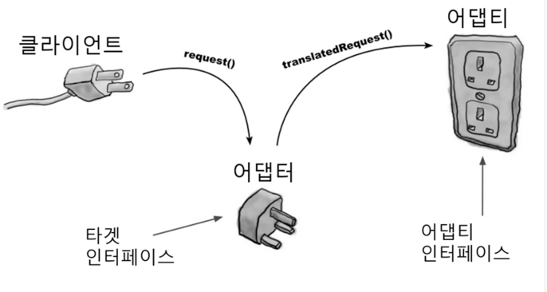
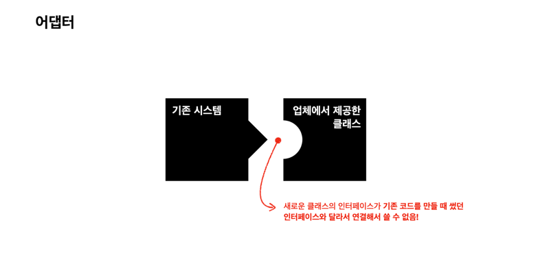
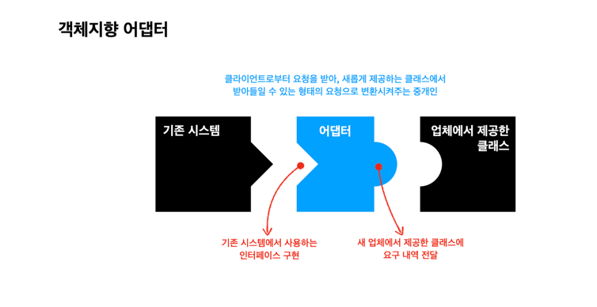
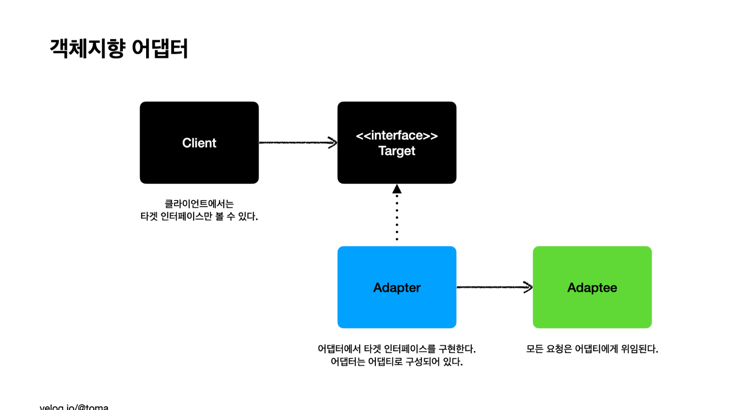
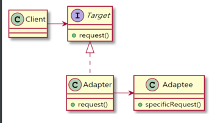

## 어댑터 패턴




- 클래스의 인터페이스를 클라이언트가 원하는 형태의 또 다른 인터페이스로 변환. 어댑터는 호환되지 않는 인터페이스 때문에 동작하지 않는 클래스들을 함께 동작할 수 있또록 만들어줌
- 서로 호환되지 않는 두 개의 인터페이스를 연결하는 작업
- 서로 다른 인터페이스를 동일하게 변환
- 예) 전기 플러그, 나라마다 서로 다른 플러그의 경우 어댑터를 사용해 변환시킬 수 있음
- 어떤 인터페이스를 클라이언트에서 요구하는 형태의 인터페이스에 적응시켜함는 역할을 함


### 문제 상황







### 클래스 다이어그램



- (1) 타겟: 클라이언트에게 제공하는 인터페이스
- (2) 어댑터: 타겟 인터페이스를 구현하며 어댑티를 구성요소로 사용, 타겟 인터페이스의 요청을 어댑티에게 위임한다.
- (3) 어댑티: 요청을 위임받아 실제로 호출되는 기능을 갖고 있는 인터페이스


### 구현 방법

- 기존 클래스의 인스턴스를 어댑터 클래스 안에서 생성해 기능 확장 및 수정

``` java
public interface Duck {
    public void quack();
    public void fly();
}

public class MallardDuck implements Duck {
    public void quack() {
        System.out.println("Quack");
    }
    public void fly() {
        System.out.println("I'm flying");
    }
}
```

```java
public interface Turkey {
    public void gobble();
    public void fly();
}

public class WildTurkey implements Turkey {
    public void gobble() {
        System.out.println("Gobble gobble");
    }
    public void fly() {
        System.out.println("I'm flying a short distance");
    }
}
```

```java
public class TurkeyAdapter implements Duck {
    Turkey turkey;
    public TurkeyAdapter(Turkey turkey) {
        this.turkey = turkey;
    }
    public void quack() {
        turkey.gobble();
    }
    public void fly() {
        for (int i = 0; i < 5; i++) {
            turkey.fly();
        }
    }
}
```

