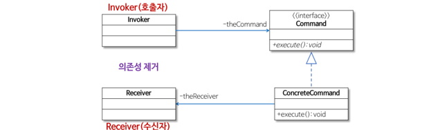
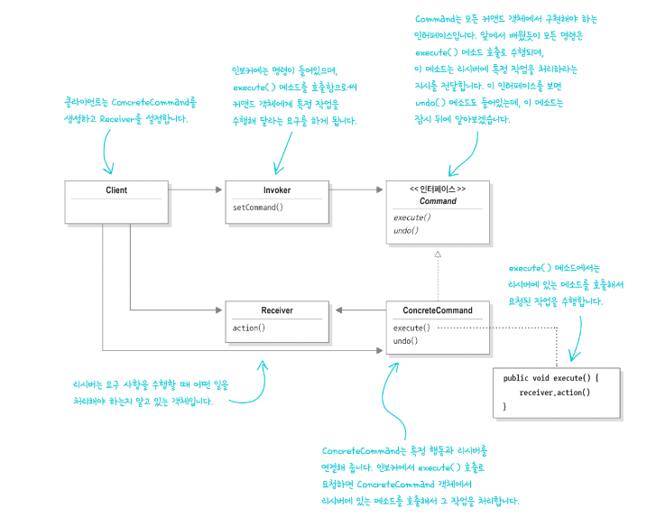
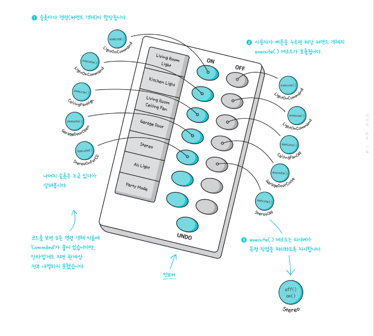

## 커맨드 패턴

- 커맨드 패턴을 사용하면 요청 내역을 객체로 캡슐화해서 객체를 서로 다른 요청 내역에 따라 매개변수화 할 수 있다.
- 이러면 요청을 큐에 저장하거나 로그로 기록하거나 작업 취소 기능을 사용할 수 있다.

- 직접 일을 하지 않고 원하는 일을 만들고 던져주면 알아서 처리해주는 객체 디자인
- 좀 더 고급스러운 표현으로는 작업 요청의 캡슐화
- ex) Java 스레드에 Runnable 객체를 던져주고 run()를 호출하면 알아서 일해준다.
- Runnable 객체를 디자인 패턴에서는 커맨드 객체(command object) - 작업 정보가 들어있는 객체라고 부른다.
- 호출하는 클래스 내에서 직접 작업처리 코드를 작성하지 않고 작업 객체를 받아서 작업 객체의 실행 메소드를 호출만 한다.

- 작업 종류의 추가, 작업 방식의 변경이 일어나도 호출하는 코드를 변경할 필요 없다.
- 작업의 분리로 인해 컨트롤 클래스와 작업 클래스를 분리할 수 있다.
- ex) Java의 Thread는 작업이 어떻게 되는지 자세히 알 필요가 없다. 다만 Runnable의 실행 메소드를 대신 호출해 줄 뿐이다.
- 따라서 작업 방식의 변경이 있을 경우 Runnable 객체만 오버라이딩 해주면 Thread는 이러한 것들을 신경쓰지 않아도 된다.