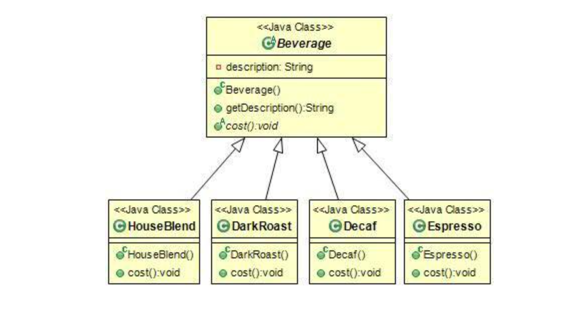
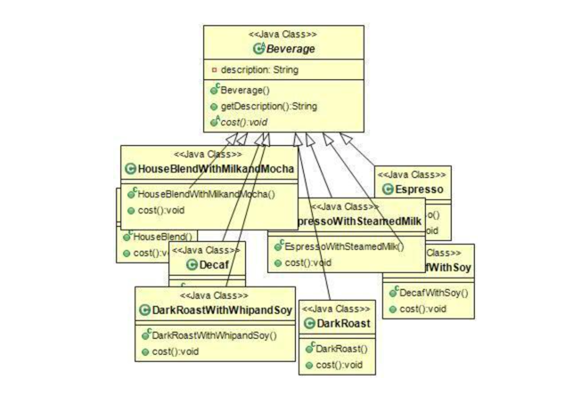
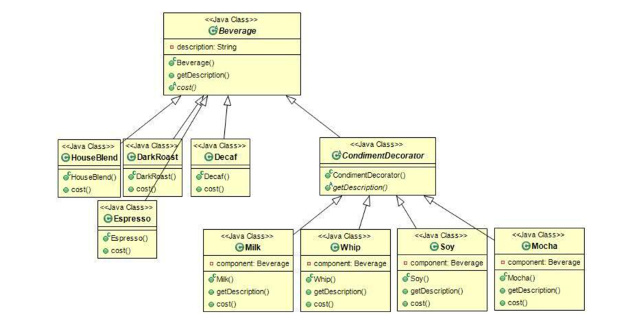
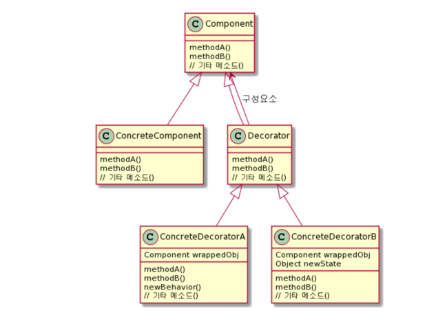
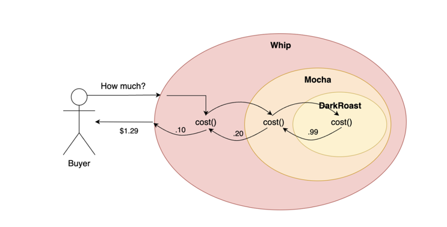

## 데코레이터(Decorator) 패턴

### 문제의 시작



- 커피를 주문할 때는 스팀 우유나 두유, 모카를 추가하고, 그 위에 휘핑 크림을 얹기도 한다.
- 각각을 추가할 때마다 커피 가격이 올라가기 때문에 주문 시스템에서도 그런 점들을 모두 고려해야 한다.



 - 한눈에 봐도 뭔가 변화가 필요하다.
 - 그렇다면 슈퍼클래스에 우유, 두유, 모카 같은 옵션여부를 나타내는 인스턴스 변수를 넣으면 어떨까?

```
public class Beverage {
	// 변수 메소드
	public int cost() {
		int totCost = 0;
		if (hasMilk())
			totCost += milkCost;
		if (hasSoy())
			totCost += soyCost;
		if (hasMocah())
			totCost += mocahCost;
		if (hasWhip())
			totCost += whipCost;
			
		return totCost;
	}
}

public class DarkRoast extends Beverage {
	@Override
	public int cost() {
		return 4500 + super.cost();
	}
}
```

- 당장은 문제가 해결된 것 같지만, 첨가물의 가격이 바뀔 때마다 기존 코드 수정이 필요하다.
- 첨가물의 종류가 많아지면 새로운 메소드를 추가해야하고, 수퍼클래스의 cost()메소드도 계속 고쳐줘야한다.
- OCP(Open-Closed principle) 원칙에 위배된다.

  

- 데코레이터 패턴 적용 후 다이어그램

### 데코레이터 패턴이란

```
데코레이터 패턴(Decorator Pattern)에서는 객체에 추가적인 요건을 동적으로 첨가한다.
데코레이터는 서브클래스를 만드는 것을 통해서 기능을 유연하게 확장할 수 있는 방법을 제공한다.
데코레이터의 슈퍼클래스는 자신이 장식하고 있는 객체의 슈퍼클래스와 같다.
한 객체를 여러 개의 데코레이터로 감쌀 수 있다.
데코레이터는 자신이 감싸고 있는 객체와 같은 슈퍼클래스를 가지고 있기 때문에 원래 객체(싸여져 있는 객체)가 들어갈 자리에 데코레이터 객체를 집어넣어도 상관없다.
데코레이터는 자신이 장식하고 있는 객체에서 어떤 행동을 위임하는 것 외에 원하는 추가적인 작업을 수행할 수 있다.
객체는 언제든지 감쌀 수 있기 때문에 실행중에 필요한 데코레이터를 마음대로 적용할 수 있다.
```



### 메소드 호출방식



- 객체를 여러 개의 데코레이터로 감쌀 수 있다.
- getCost 메소드 호출 시 가장 바깥에 있는 Whip 클래스의 cost()를 호출한다.
- Whip에서는 Mocha의 cost()를 호출한다.
- Mocha에서는 다시 DarkRoast의 cost()를 호출한다.
- DarkRoast에서는 99센트를 리턴한다
- Mocha에서는 DarkRoast에서 리턴 받은 가격에 모카 값 20센트를 더해서 총 1.19$를 리턴한다.
- Whip에서는 mocha에서 받은 가격에 10센트를 다시 추가해서 최종결과인 1.29$를 리턴한다.