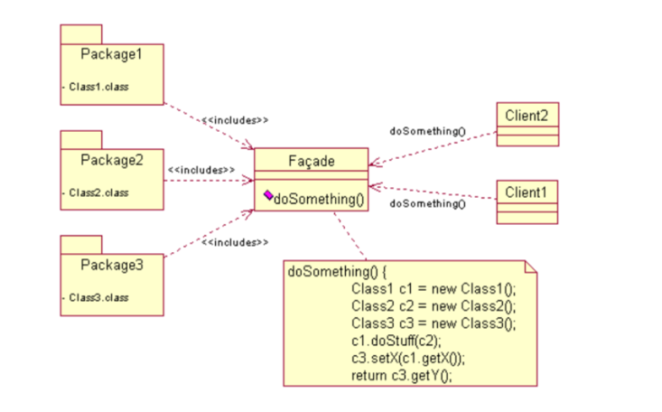

## 퍼사드(Facade) 패턴

- Facade는 "건물의 정면"을 의미하는 단어로 어떤 소프트웨어의 다른 커다란 코드 부분에 대하여 간략화된 인터페이스를 제공해주는 디자인 패턴을 의미합니다. 
- 퍼사드 객체는 복잡한 소프트웨어 바깥쪽의 코드가 라이브러리의 안쪽 코드에 의존하는 일을 감소시켜 주고, 복잡한 소프트웨어를 사용 할 수 있게 간단한 인터페이스를 제공해줍니다.

### 동기

- 영화관에서 영화를 상영하는 시스템이 있다고 생각해보자.
- 영화를 상영하기 위해 필요한 절차는 아래와 같다.
1. 조명을 영화관 모드로 변경
2. 스크린을 내림
3. 프로젝터를 킴
4. 프로젝터를 영화관 모드로 변경
5. DVD Player를 킴
6. DVD Player에서 영화를 시작

- 위의 모든 과정을 수행하기 위해서는 조명, 프로젝터, 스크린, DVD Player 객체를 알고 있어야 한다.
- 클라이언트가 이 모든 객체를 알고 있으면 결합도가 상당히 높고 복잡해진다.
- 퍼사드 패턴을 이용하여 클라이언트는 퍼사드 객체 하나만으로 영화를 상영할 수 있게 구현해본다.

### 클래스 다이어그램



### 최소 지식 원칙(드메테르 법칙)

1. 객체 자체의 메서드만 호출한다.
2. 메서드에 매개변수로 전달된 객체의 메서드만 호출한다.
3. 메서드에서 생성하거나 인스턴스를 만드는 객체의 메서드만 호출한다.
4. 객체의 구성요소에 속하는 객체들의 메서드만을 호출한다.

- 이 원칙을 지키면 객체들 사이의 의존성을 줄일 수 있어 결합도를 낮추고 응집도가 높은 객체지향적인 설계가 가능해진다.

```java
public float getTemp() {
    /*
        어떤 메소드를 호출한 결과로 리턴받는 객체에 있는 메소드를 호출하고 있다.
        의존 관계가 늘어나고 있으므로 그 객체 쪽에서 대신 요청을 하도록 만들어야 한다.
     */
    return station.getThermometer().getTemperature();
}
```

```java
public float getTemp() {
    /*
        최소 지식 원칙을 적용하여 Station 클래스에 thermometer에 요청을 해주는 메소드를 추가했다.
        이렇게 하면 의존해야 하는 클래스의 개수를 줄일 수 있다.
     */
    return station.getTemperature();
}
```

```java
public Class Car {
    Engine engine; 
    
    public Car() {
        // 엔진 초기화 등을 처리
    }
    
    public void start(Key key) {
        Doors doors = new Doors();
        
        // 매개변수로 전달받은 객체의 메소드는 직접 호출해도 된다.
        boolean authorized = key.turns();
        
        if (authorized) {
            // 클래스의 구성 요소는 직접 호출해도 된다.
            engine.start();
            // 객체 내에 있는 메소드는 호출해도 된다.
            updateDashboardDisplay();
            // 직접 생성하거나 인스턴스를 만든 객체의 메소드는 호출해도 된다.
            doors.lock();
        }
        
        public void updateDashboardDisplay() {
            // 디스플레이 갱신
        }
}
```

- Q. 최소 지식 원칙에는 어떤 단점이 있나요?
- A. 이 원칙을 잘 따르면 객체들 사이의 의존성을 줄일 수 있고, 소프트웨어 관리가 용이해질 수 있다. 하지만 이 원칙을 적용하다 보면 다른 구성요소에 대한 메소드 호출을 처리하기 위해 "래퍼" 클래스를 더 만들어야 할 수도 있다. 그러다보면 시스템이 더 복잡해지고, 개발 시간도 늘어나고, 성능이 떨어짓 루 있다.