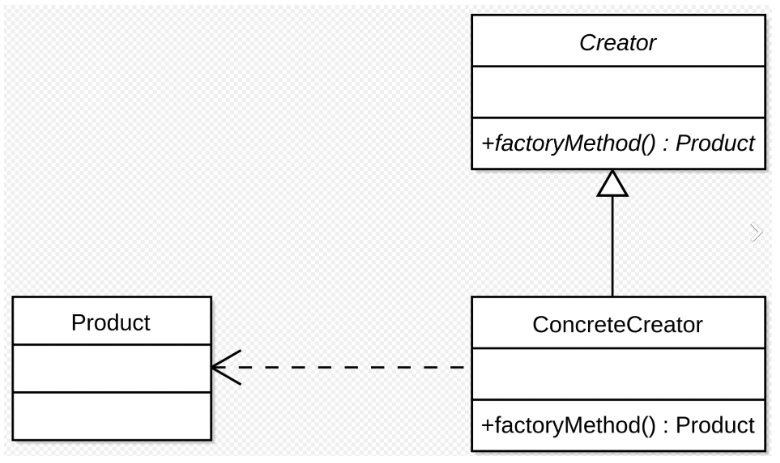
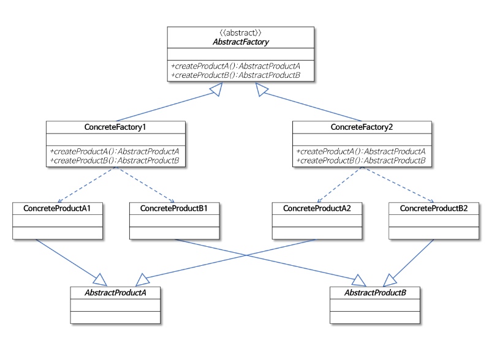

## 팩토리(Factory) 패턴

### 문제의 시작

- 다음은 피자를 주문하는 코드이다.
- 피자 메뉴를 새로 개발하거나 제외할 때 코드의 변경이 필요하다.
- 피자를 주문하는 로직만 담당해야 하는 부분이므로 new 를 통해 피자를 만드느 부분을 분리해 팩토리 패턴을 적용한다.

```java
Pizza orderPizza(String type) {
  Pizza pizza;
  
  if(type.equals("cheese") {
    pizza = new CheesePizza();
  } else if(type.equals("greek") {
    pizza = new GreekPizza();
  } else if(type.equals("clam") {
    pizza = new ClamPizza();    
  }
  
  pizza.prepare();
  pizza.bake();
  pizza.cut();
  return pizza;
}

````

### 팩토리 메소드 패턴

- 팩토리 메소드 패턴(Factory Method Pattern)은 객체를 생성하기 위해 인터페이스를 만듭니다. 어떤 클래스의 인스턴스를 만들지를 서브클래스에서 결정하도록 합니다. 팩토리 메소드를 이용하면 인스턴스를 만드는 일을 서브클래스로 미룰 수 있습니다.



````java
// Creator
public abstract class PizzaStore {
    public Pizza orderPizza(String type) {
        Pizza pizza = createPizza(type);

        pizza.prepare();
        pizza.bake();
        pizza.box();

        return pizza;
    }

    abstract Pizza createPizza(String type);
}

// ConcreteCreator
public class NYPizzaStore extends PizzaStore {
    @Override
    Pizza createPizza(String item) {
        if ("cheese".equals(item)) {
            return new NYStyleCheesePizza();
        } else if ("veggie".equals(item)) {
            return new NYStyleVeggiePizza();
        } else if ("clam".equals(item)) {
            return new NYStyleClamPizza();
        } else {
            return null;
        }
    }
}

// ConcreteCreator
public class ChicagoPizzaStore extends PizzaStore {
    @Override
    Pizza createPizza(String item) {
        if ("cheese".equals(item)) {
            return new ChicagoStyleCheesePizza();
        } else if ("veggie".equals(item)) {
            return new ChicagoStyleVeggiePizza();
        } else if ("clam".equals(item)) {
            return new ChicagoStyleClamPizza();
        } else {
            return null;
        }
    }
}

//Product
public abstract class Pizza {
    String name;
    String dough;
    String sauce;

    void prepare() {
        System.out.println("preparing~~ " + name);
    }

    void bake() {
        System.out.println("baking~~");
    }

    void box() {
        System.out.println("boxing~~");
    }

    public String getName() {
        return name;
    }
}

public class PizzaTestDrive {

    public static void main(String[] args) {
        PizzaStore nyStore = new NYPizzaStore();
        PizzaStore chicagoStore = new ChicagoPizzaStore();

        // 지점과 주어진 타입에 따라 다른 피자가 만들어진다

        Pizza nyCheesePizza = nyStore.orderPizza("cheese");
        Pizza nyClamPizza = nyStore.orderPizza("clam");

        Pizza chicagoCheesePizza = chicagoStore.orderPizza("cheese");
        Pizza chicagoClamPizza = chicagoStore.orderPizza("clam");
    }
}


````

### 추상 팩토리 패턴 

- 추상 팩토리 패턴은 연관된 하위 클래스를 특정 그룹으로 묶어서 한번에 교체할 수 있도록 한다. 팩토리 메서드 패턴과 유사한데 팩토리 메서드에서는 팩토리에서 구체적인 클래스를 지정하여 인스턴스를 생성한 반면 추상 팩토리 패턴은 상위 팩토리 클래스가 따로 존재하여 하위 팩토리 클래스에 대한 인터페이스를 제공하고 인스턴스의 생성은 하위 팩토리 클래스에서 발생합니다.


- AbstractFactory 실제 팩토리 클래스의 공통 인터페이스
- ConcreteFactory 구체적인 팩토리 클래스로 AbstractFactory클래스의 추상 메서드를 오버라이드 함으로써 구체적인 제품을 생성함.
- AbstractProduct 제품의 공통 인터페이스
- ConcreteProduct 구체적인 팩토리 클래스에서 생성되는 구체적인 제품

````JAVA

// 피자 재료를 만드는 팩토리 인터페이스 PizzaIngredientFactory
public interface PizzaIngredientFactory {
    Dough createDough();
    Sauce createSauce();
}

//PizzaIngredientFactory를 확장해 두 팩토리 구성 클래스를 만들고 createDough와 createSauce 메소드를 구현
public class NYPizzaIngredientFactory implements PizzaIngredientFactory {
    @Override
    public Dough createDough() {
        return new ThinCrustDough();
    }

    @Override
    public Sauce createSauce() {
        return new MarinaraSauce();
    }
}

public class ChicagoPizzaIngredientFactory implements PizzaIngredientFactory {
    @Override
    public Dough createDough() {
        return new ThinCrustDough();
    }

    @Override
    public Sauce createSauce() {
        return new PlumTomatoSauce();
    }
}

// NYPizzaStore는 각 피자를 만들 때 사용할 재료를 만들기 위해 쓸 피자 재료 공장 각 객체에 전달 해준다.
public class NYPizzaStore extends PizzaStore {
    protected Pizza createPizza(String item) {
        Pizza pizza = null;
        PizzaIngredientFactory ingredientFactory = new NYPizzaIngredientFactory();

        if (item.equals("cheese")) {
            pizza = new CheesePizza(ingredientFactory);
            pizza.setName("New York Style Cheese Pizza");
        } else if (item.equals("veggie")) {
            pizza = new VeggiePizza(ingredientFactory);
            pizza.setName("New York Style Veggie Pizza");
        }
        return pizza;
    }
}


````
