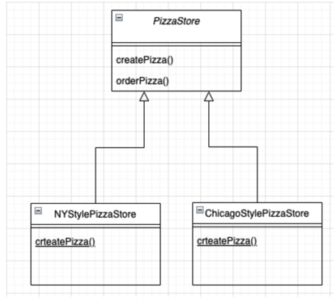
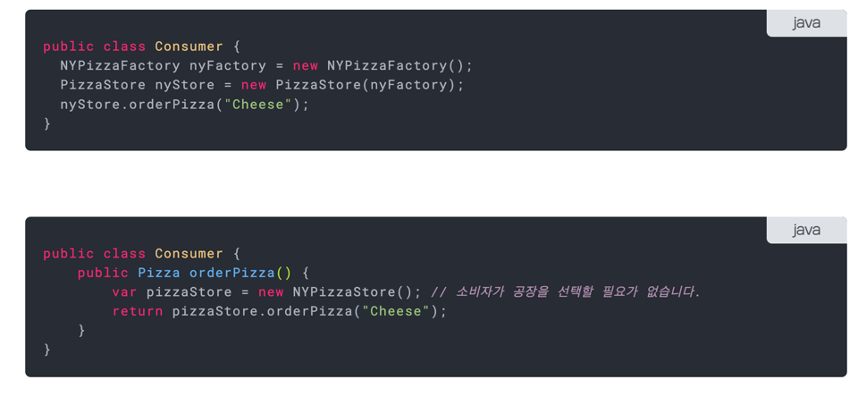

## 팩토리(Factory) 패턴

### 문제의 시작

- 피자 메뉴를 새로 개발하거나 제외할 때 코드의 변경이 필요하다.

```java
Pizza orderPizza(String type) {
  Pizza pizza;
  
  if(type.equals("cheese") {
    pizza = new CheesePizza();
  } else if(type.equals("greek") {
    pizza = new GreekPizza();
  } else if(type.equals("clam") {
    pizza = new ClamPizza();    
  }
  
  pizza.prepare();
  pizza.bake();
  pizza.cut();
  return pizza;
}
```

- 인스턴스를 만들 구상 클래스를 선택하는 부분이 계속 변경이 필요하다.
- 변하는 부분은 캡슐화를 할 수 있다.
- 조건절만 따로 빼서 인스턴스를 생성하는 코드를 다른 클래스에 위임하자.
- 새로 만들 객체에는 팩토리라는 이름을 붙인다.

````java
public class SimplePizzaFactory {
  public Pizza createPizza(String type) {
    Pizza pizza = null;

    if(type.equals("cheese")) {
      pizza = new CheesePizza();
    } else if(type.equals("greek")) {
      pizza = new GreekPizza();
    } else if(type.equals("clam")) {
      pizza = new ClamPizza();
    }
    return pizza;
  }
} 

````

````java
public class PizzaStore {
  SimplePizzaFactory factory;

  public PizzaStore(SimplePizzaFactory factory) {
    this.factory = factory;
  }

  public Pizza orderPizza(String type) {
    Pizza pizza;

    pizza = factory.createPizza(type);
    
    pizza.prepare();
    pizza.bake();
    pizza.cut();
    return pizza;
  }
}
````

### 추상 팩토리 패턴

- 피자 사업이 잘 되어서 분점을 내게 되었다.
- 각 지점마다 그 지역의 특성을 살린 피자를 만들어야 한다.
- 위에서 사용한 SimplePizzaFactory를 빼고 새로운 NYPizzaFactory, ChicagoPizzaFactory를 만들면 어떨까

````java
NYPizzaFactory nyFactory = new NYPizzaFactory();
PizzaStore nyStroe = new PizzaStore(nyFactory);
nyStore.order("Veggie");

ChicagoPizzaFactory chicagoFactory = new ChicagoPizzaFactory();
PizzaStore chicagoStore = new PizzaStore(chicagoStore);
chicagoStore.order("Veggie");
````

- 위와 같이 분점을 정의할 경우, 피자 팩토리와 피자 스토어의 연관관계가 존재하지 않아서 각 분점에서 본점의 지침을 따르지 않고 마음대로 피자를 만드는 경우가 발생한다.
- 어떻게 하면 피자 가게와 피자를 만드는 과정을 하나로 묶을 수 있을까



- 객체를 생성하는 create메소드를 구상 클래스에 위임했으므로 서브 클래스에서 반드시 create를 구현해야한다.



- 변경 후 클라이언트는 피자 팩토리를 선택할 필요가 없게 된다.

### 팩토리 메소드 패턴
