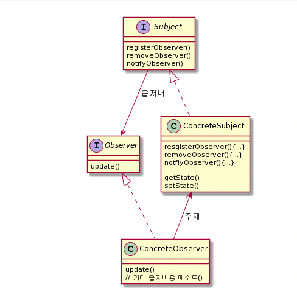
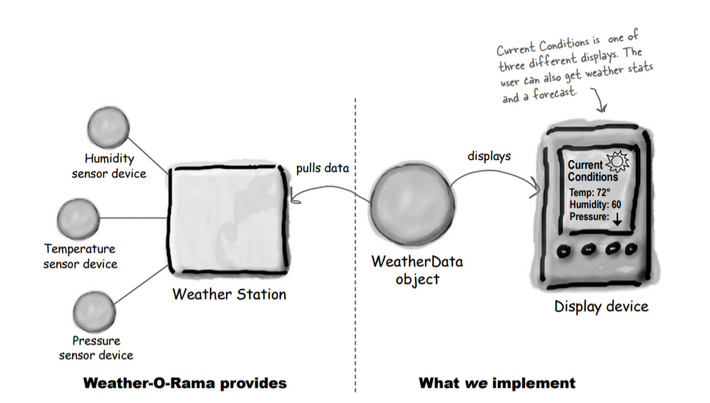
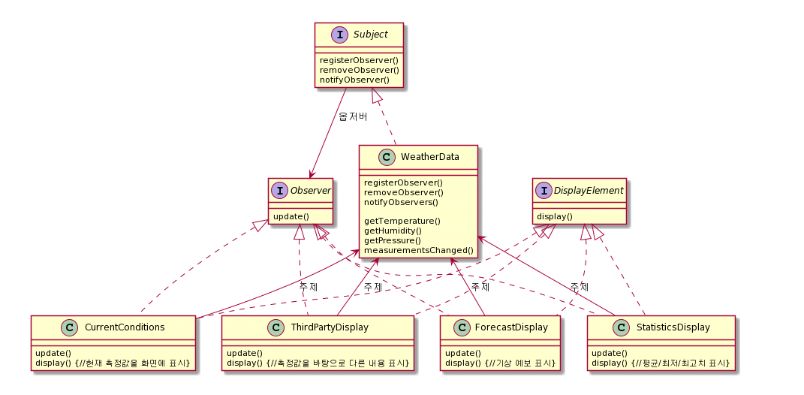

## 옵저버(Observer) 패턴

### 옵저버 패턴이란
 - 한 객체의 상태가 바뀌면 그 객체에 의존하는 다른 객체들한테 연락이 가고 자동으로 내용이 갱신되는 방식으로 일대다(One-To-Many) 의존성을 정의한다
 - 일대다 관계는 주제(Subject)와 옵저버(Observer)에 의해 정의된다.
 - 옵저버 패턴을 구현하는 방법에는 여러가지가 있지만, 대부분 주제(Subject) 인터페이스와 옵저버(Observer) 인터페이스가 들어있는 클래스 디자인을 바탕으로 한다.

### 일대다 관계
 - 옵저버 패턴에서 상태를 저장하고 지배하는 것은 주제 객체이다. 따라서 상태가 들어있는 객체는 하나만 있을 수 있다.
 - 하지만 옵저버는 사용하긴 하지만 반드시 상태를 가지고 있어야 하는 것은 아니므로 옵저버는 여러개가 있을 수 있고, 주제 객체에서 상태가 바뀌었다는 것을 알려주기를 기다리는, 주제에 의존적인 성질을 가지게 된다.
 - 따라서 하나의 주제와 여러개의 옵저버가 연관된, 일대다(one-to-many) 관계가 성립된다.

### 느슨한 결합
 - 두 객체가 느슨하게 결합되어 있다는 것은, 그 둘이 상호작용을 하긴 하지만 서로에 대해 잘 모른다는 것을 의미한다.
 - 옵저버 패턴에서는 주제와 옵저버가 느슨하게 결합되어 있는 객체 디자인을 제공한다.
 
> 1. 주제가 옵저버에 대해서 아는것은 옵저버가 특정 인터페이스(Observer 인터페이스)를 구현한다는 것 뿐이다.
> - 옵저버의 구상클래스가 무엇인지, 옵저버가 무엇을 하는지 등에 대해서는 알 필요가 없다.
> 2. 옵저버는 언제든지 새로 추가할 수 있다.
> - 주제는 Observer 인터페이스를 구현하는 객체의 목록에만 의존하기 때문에 언제든지 새로운 옵저버를 추가하거나, 기존 옵저버를 제거하거나 등의 작업을 할 수 있다.
> 3. 새로운 형식의 옵저버를 추가하려고 할 때도 주제를 전혀 변경할 필요가 없다.
> - 새로운 클래스에서 Observer 인터페이스를 구현하고 옵저버로 등록하기만 하면 된다.
> 4. 주제와 옵저버는 서로 독립적으로 재사용할 수 있다.
> - 주제와 옵저버가 서로 단단하게 결합되어 있지 않기 때문에 다른 용도로 손쉽게 재사용이 가능하다.
> 5. 주제나 옵저버가 바뀌더라도 서로한테 영향을 미치지 않는다.
> - 둘이 서로 느슨하게 결합되어 있기 때문이다.

### 기상 모니터링 애플리케이션 개요
 - 이 시스템은 기상 스테이션(실제 기상 정보를 수집하는 장비)과 WeatherData 객체(기상 스테이션으로부터 오는 데이터를 추적하는 객체), 그리고 사용자에게 현재 기상 조건을 보여주는 디스플레이, 이렇게 세 요소로 이루어진다.
 - WeatherData 객체에서는 기상 스테이션 장비 자체로부터 데이터를 가져올 수 있다. 데이터를 가져온 후에는 디스플레이 장비에 세 가지 항목을 표시할 수 있다. 첫번째는 현재조건(온도, 습도, 압력)이고, 두번째는 기상 통계, 세번째는 간단한 기상 예보이다.
 - WeatherData 객체를 사용하여 현재 조건, 기상 통계, 기상 예측, 이렇게 세 항목을 디스플레이 장비에서 갱신해 가면서 보여주는 애플리케이션을 만들어야 한다. (확장 가능하게)

### 기상 모니터링 애플리케이션 설계

