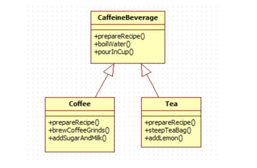

## 템플릿 메소드 패턴

### 템플릿 메소드 패턴이란
 - 메소드에서 알고리즘의 골격을 정의한다.
 - 알고리즘의 여러 단계 중 일부는 서브클래스에서 구현할 수 있다.
 - 템플릿 메소드를 이용하면 알고리즘의 구조는 그대로 유지하면서 서브클래스에서 특정 단계를 재정의 할 수 있다.


### 커피와 차를 만드는 방법
```java
1. 커피 만드는 법

1) 물을 끓인다.

2) 끓는 물에 커피를 우려낸다.

3) 커피를 컵에 따른다.

4) 설탕과 우유를 추가한다.

        
2. 홍차 만드는 법

1) 물을 끓인다.

2) 끓는 물에 차를 우려낸다.

3) 차를 컵에 따른다.

4) 레몬을 추가한다.
```

```java
public class Coffee {

	void prepareRecipe() {
		boilWater();
		brewCoffeeGrinds();
		pourInCup();
		addSugarAndMilk();
	}

	public void boilWater() {
		System.out.println("물 끓이는 중");
	}

	public void breqCoffeeGrinds() {
		System.out.println("필터를 통해 커피를 우려내는 중");
	}

	public void pourInCup() {
		System.out.println("컵에 따르는 중");
	}

	public void addSugarAndMilk() {
		System.out.println("설탕과 우유를 추가하는 중");
	}

}
```

```java
public class Tea {

	void prepareRecipe() {
		boilWater();
		steepTeaBag();
		pourInCup();
		addLemon();
	}

	public void boilWater() {
		System.out.println("물 끓이는 중");
	}

	public void steepTeaBag() {
		System.out.println("차를 우려내는 중");
	}

	public void pourInCup() {
		System.out.println("컵에 따르는 중");
	}

	public void addLemon() {
		System.out.println("레몬을 추가하는 중");
	}
}
```

```java
void prepareRecipe() {
    // brew와 condiments를 추상화해 구상 클래스에서 정의하도록 한다.

	boilWater();
	brew();

	pourInCup();

	addCondiments();

}
```

```java
1. Tea 객체를 만들고.
Tea myTea = new Tea();

2. 템플릿 메소드를 호출한다.
myTea.prepareRecipe(); 카페인 음료를 만들기 위한 알고리즘이 돌아간다.

3. 물을 끓인다.
boilWater(); 이 단계는 CaffeineBeverage 에서 처리된다.

4. 이제 차를 우려낸다.
brew(); 이방법은 서브클래스만 알고있다.

5. 차를 컵에 따른다.
pourInCup(); 이 단계도 공통적인 부분이기 때문에 Caffeinebeverage 에서 맡아서 처리된다.

6. 마지막으로 첨가물을 추가한다.
addCondiments(); 첨가물은 음료마다 다르기때문에 서브클래스에서 처리된다.
```

### 템플릿 메소드와 후크

- 후크(hook)는 추상클래스에서 선언되는 메소드긴 하지만 기본적인 내용만 구현되어 있거나 아무 코드도 들어있지 않은 메소드 이다.
- 이렇게 하면 서브클래스 입장에서는 다양한 위치에서 알고리즘에 끼어들수 있다.

### 헐리우드 원칙과 템플릿 메소드 패턴

- 먼저 연락하지 마세요. 저희가 연락 드리겠습니다.
- 헐리우드 원칙을 사용하면, 저수준 구성요소에서 시스템에 접속을 할수는 있지만, 언제 어떤 식으로 그 구성요소들을 사용할지는 고수준 구성요소에서 결정하게 된다.
- 즉 저수준 구성요소는 컴퓨테이션에 참여할 수는 있지만 절대 고수준 구송요소를 직접 호출하면 안된다는 것이다.



- CaffeineBeverage는 고수준 구성요소 이다. 음료를 만드는 방법에 대당하는 알고리즘을 장악하고있고, 메소드 구현이 필요한 상태에서만 서브클래스를 불러낸다
- Coffee와 Tea 와 같은 서브클래스는 각각의 자질구레한 메소드 구현을 제공하기 위한 용도로만 쓰인다. 이와같은 서브클래스들은 고수준 구성요소인 CaffeineBeverage 클래스로부터 호출 당하기 전까지는 절대로 CaffeineBeverage 추상 클래스를 직접 호출하지 않는다.
- 이렇게 함으로 caggeinebeverage 클래스의 클라이언트에서는 Tea나 Coffee 같은 구상 클래스가 아닌 CaffeineBeverage에 추상화 되어 있는 부분에 의존하게 된다. 그렇게 함으로써 전체 시스템의 의존성이 줄어들 수 있다.

